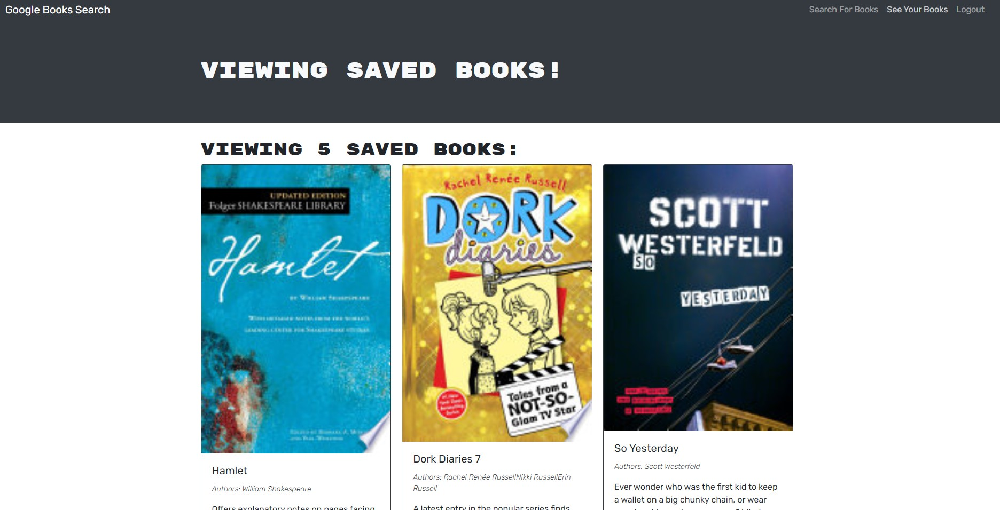

# MERN_Book_Search

* Deployed Application: https://serene-savannah-69805.herokuapp.com/

## Table-of-Contents

1. [Description](#description)

2. [User Story](#user-story)

3. [Installation](#installation)

4. [Technologies](#technologies)

5. [Contact Me](#contact-me)


## Description

This Google book search engine API was built with a RESTful API using Node.js  and express for the server, MongoDB for a database,React for the front end. The application has been refactored to have the same functionality, but using a graphql API and Apollo server. The application was also deployed to Heroku via the link above.



## User Story 

```md
AS AN avid reader
I WANT to search for new books to read
SO THAT I can keep a list of books to purchase
```

## Installation

* You can use the application in your browser via the heroku link at the top of the page.

    - If you want to run the application locally, follow the steps below

1. clone the repo with this link: https://github.com/Laurencvengros/MERN_Book_Search.git
2. open the root application in your terminal and run the command  npm install
3. npm start 

* Ensure you have MongoDB installed in order to run the application on your local computer


## Technologies

1. Node.js/ Express.js
2. Heroku
3. MongoDB/mongoose
4. React
5. Apollo
6. Graphql
7. JSON Web Token

## Contact Me

This Application was created by me, Lauren Cvengros.

For questions/comments/concerns please contact me via the information below

* Author: Lauren Cvengros
* Email: L.Cvengros@icloud.com
* github: Lauurencvengros -> https://github.com/Laurencvengros